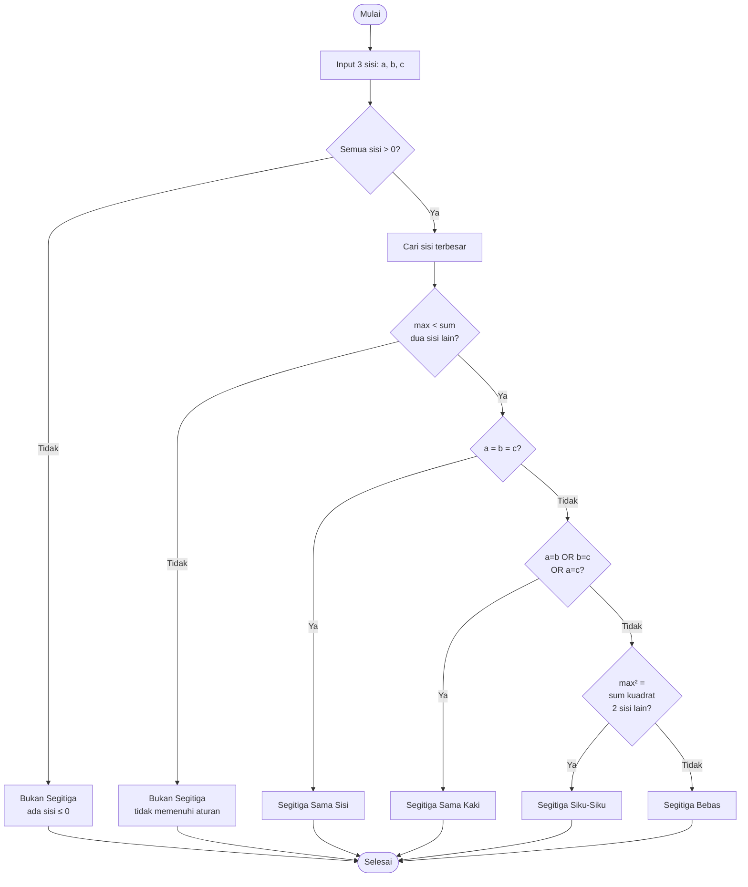

# SOAL 1 – Determine Triangle (C)

## 📌 Deskripsi Soal

Program untuk menentukan jenis segitiga berdasarkan 3 sisi input (a, b, c).

### Aturan Klasifikasi:

1. ❌ **Tidak ada segitiga** jika:
   - Ada sisi ≤ 0
   - Sisi terbesar ≥ jumlah dua sisi lainnya

2. ✅ **Segitiga Sama Sisi (Equilateral)** jika:
   - a = b = c

3. ✅ **Segitiga Sama Kaki (Isosceles)** jika:
   - a = b ATAU b = c ATAU a = c (tapi tidak semua sama)

4. ✅ **Segitiga Siku-Siku (Right Triangle)** jika:
   - (sisi terbesar)² = (sisi₁)² + (sisi₂)²

5. ✅ **Segitiga Bebas (Scalene)** jika:
   - Tidak termasuk kategori di atas

---

## 📊 Flowchart



---

## 📁 File Program

| File | Deskripsi |
|------|-----------|
| `soal1.c` | Versi **bilangan bulat** (integer) |
| `Soalno1bag2.c` | Versi **bilangan pecahan** dengan toleransi 1% |

---

## ⚙️ Cara Compile & Run

### Versi 1: Bilangan Bulat

**Compile:**
```bash
gcc soal1.c -o soal1
```

**Run:**
```bash
./soal1
```

### Versi 2: Bilangan Pecahan (Toleransi 1%)

**Compile:**
```bash
gcc Soalno1bag2.c -o soal1bag2 -lm
```
> **Note:** Flag `-lm` diperlukan untuk library `math.h`

**Run:**
```bash
./soal1bag2
```

---

## 🖥️ Contoh Output

### Contoh 1: Segitiga Sama Sisi
```
Masukkan tiga sisi segitiga (a b c): 5 5 5
Segitiga Sama Sisi (Equilateral)
```

### Contoh 2: Segitiga Sama Kaki
```
Masukkan tiga sisi segitiga (a b c): 5 5 7
Segitiga Sama Kaki (Isosceles)
```

### Contoh 3: Segitiga Siku-Siku
```
Masukkan tiga sisi segitiga (a b c): 3 4 5
Segitiga Siku-Siku (Right Triangle)
```

### Contoh 4: Segitiga Bebas
```
Masukkan tiga sisi segitiga (a b c): 3 4 6
Segitiga Bebas (Scalene)
```

### Contoh 5: Bukan Segitiga (sisi ≤ 0)
```
Masukkan tiga sisi segitiga (a b c): -3 4 5
Bukan segitiga (ada sisi <= 0)
```

### Contoh 6: Bukan Segitiga (tidak memenuhi aturan)
```
Masukkan tiga sisi segitiga (a b c): 1 2 10
Bukan segitiga (sisi terbesar >= jumlah dua sisi lainnya)
```

---

## 🔍 Penjelasan Versi Pecahan (Toleransi 1%)

### Fungsi `hampir_sama()`

```c
int hampir_sama(double x, double y) {
    double max_xy = fmax(fabs(x), fabs(y));
    if (max_xy < 1e-12) return 1;
    return fabs(x - y) <= TOL * max_xy;
}
```

**Konsep Toleransi 1%:**
- Dua nilai dianggap **sama** jika selisihnya ≤ 1% dari nilai terbesar
- Contoh: 5.0 dan 5.04 dianggap sama (selisih 0.8%)
- Contoh: 5.0 dan 5.06 dianggap beda (selisih 1.2%)

### Contoh Input Pecahan

```
Masukkan tiga sisi segitiga (a b c): 5.0 5.04 5.02
Segitiga Sama Sisi (Equilateral)
```
> Karena selisih < 1%, semua sisi dianggap sama

---

## ✅ Validasi Program

### Test Case Bilangan Bulat

| Input | Expected Output | Status |
|-------|----------------|--------|
| 5 5 5 | Sama Sisi | ✅ |
| 5 5 7 | Sama Kaki | ✅ |
| 3 4 5 | Siku-Siku | ✅ |
| 3 4 6 | Bebas | ✅ |
| -3 4 5 | Bukan Segitiga | ✅ |
| 1 2 10 | Bukan Segitiga | ✅ |

### Test Case Bilangan Pecahan

| Input | Expected Output | Status |
|-------|----------------|--------|
| 5.0 5.04 5.02 | Sama Sisi (toleransi) | ✅ |
| 3.0 4.0 5.0 | Siku-Siku | ✅ |
| 3.0 4.0 5.06 | Bebas | ✅ |

---

## 🎯 Fitur Utama

- ✅ Validasi input (cek sisi > 0)
- ✅ Validasi aturan segitiga
- ✅ Klasifikasi 4 jenis segitiga
- ✅ Support bilangan bulat & pecahan
- ✅ Toleransi 1% untuk floating point
- ✅ Perhitungan siku-siku dengan teorema Pythagoras

---

## 📝 Catatan Teknis

1. **Library yang Digunakan:**
   - `stdio.h` - Input/output
   - `math.h` - Fungsi `fmax()`, `fabs()`, dan operasi matematika

2. **Konstanta:**
   - `TOL = 0.01` - Toleransi 1% untuk perbandingan float

3. **Algoritma:**
   - Mencari nilai maksimum dari 3 sisi
   - Validasi dengan inequality theorem
   - Perbandingan dengan/tanpa toleransi

---

**Dibuat oleh: Irgi**  
**Bahasa: C**  
**Tugas: PSPEC - DPPL**