# SOAL 2 – Computer Service Billing (Structured English - C)

## 📌 Deskripsi Soal

Program untuk menghitung biaya servis komputer berdasarkan aturan **Structured English**.

### Aturan Biaya:

#### 1️⃣ Base Fee (berdasarkan jumlah komputer)
- **1-2 komputer:** Base fee = $50, Additional fee = $0
- **3-10 komputer:** Base fee = $100, Additional fee = $10 per peripheral
- **>10 komputer:** Base fee = $500, Additional fee = $10 per peripheral

#### 2️⃣ Modifier Biaya
- ⏰ **Luar jam kerja:** Base fee **×2** (digandakan)
- 🚗 **Antar-jemput sendiri:** Base fee **÷2** (dikurangi setengah)

#### 3️⃣ Total Biaya
```
Total = Base Fee (setelah modifier) + Additional Fee
```

---

## 📊 Flowchart

```mermaid
flowchart TD
    Start([Mulai]) --> Input[Input Data:<br/>- Jumlah komputer<br/>- Jumlah peripheral<br/>- Luar jam kerja?<br/>- Antar-jemput?]
    
    Input --> CheckAmount{Jumlah<br/>Komputer?}
    
    CheckAmount -->|1-2| Fee1[Base: $50<br/>Additional: $0]
    CheckAmount -->|3-10| Fee2[Base: $100<br/>Additional: $10 × peripheral]
    CheckAmount -->|>10| Fee3[Base: $500<br/>Additional: $10 × peripheral]
    
    Fee1 --> CheckAfterHours{Luar jam<br/>kerja?}
    Fee2 --> CheckAfterHours
    Fee3 --> CheckAfterHours
    
    CheckAfterHours -->|Ya| Double[Base Fee × 2]
    CheckAfterHours -->|Tidak| CheckDropOff{Antar-jemput<br/>sendiri?}
    
    Double --> CheckDropOff
    
    CheckDropOff -->|Ya| Half[Base Fee ÷ 2]
    CheckDropOff -->|Tidak| Calculate[Hitung Total]
    
    Half --> Calculate
    Calculate --> Display[Tampilkan:<br/>- Base Fee<br/>- Additional Fee<br/>- Total]
    
    Display --> End([Selesai])
```



---

## ⚙️ Cara Compile & Run

**Compile:**
```bash
gcc soal2.c -o soal2
```

**Run:**
```bash
./soal2
```

---

## 🖥️ Contoh Output

### Contoh 1: 2 Komputer, Jam Kerja Normal

**Input:**
```
Masukkan jumlah komputer: 2
Masukkan jumlah peripheral: 3
Apakah servis di luar jam kerja? (1 untuk Ya, 0 untuk Tidak): 0
Apakah pelanggan bersedia antar-jemput sendiri? (1 untuk Ya, 0 untuk Tidak): 0
```

**Output:**
```
--- Proses Kalkulasi ---
Biaya dasar awal      : $50.00

==========================================
           Rincian Biaya Final
==========================================
Biaya Dasar (Base Fee)      : $50.00
Biaya Tambahan (Peripherals): $0.00
------------------------------------------ +
Total Biaya Servis          : $50.00
==========================================
```

### Contoh 2: 5 Komputer, 3 Peripheral, Luar Jam Kerja

**Input:**
```
Masukkan jumlah komputer: 5
Masukkan jumlah peripheral: 3
Apakah servis di luar jam kerja? (1 untuk Ya, 0 untuk Tidak): 1
Apakah pelanggan bersedia antar-jemput sendiri? (1 untuk Ya, 0 untuk Tidak): 0
```

**Output:**
```
--- Proses Kalkulasi ---
Biaya dasar awal      : $100.00
-> Biaya dasar digandakan menjadi $200.00 (servis di luar jam kerja).

==========================================
           Rincian Biaya Final
==========================================
Biaya Dasar (Base Fee)      : $200.00
Biaya Tambahan (Peripherals): $30.00
------------------------------------------ +
Total Biaya Servis          : $230.00
==========================================
```

### Contoh 3: 15 Komputer, 5 Peripheral, Antar-Jemput Sendiri

**Input:**
```
Masukkan jumlah komputer: 15
Masukkan jumlah peripheral: 5
Apakah servis di luar jam kerja? (1 untuk Ya, 0 untuk Tidak): 0
Apakah pelanggan bersedia antar-jemput sendiri? (1 untuk Ya, 0 untuk Tidak): 1
```

**Output:**
```
--- Proses Kalkulasi ---
Biaya dasar awal      : $500.00
-> Biaya dasar dikurangi setengah menjadi $250.00 (antar-jemput sendiri).

==========================================
           Rincian Biaya Final
==========================================
Biaya Dasar (Base Fee)      : $250.00
Biaya Tambahan (Peripherals): $50.00
------------------------------------------ +
Total Biaya Servis          : $300.00
==========================================
```

### Contoh 4: 8 Komputer, 4 Peripheral, Luar Jam Kerja + Antar-Jemput

**Input:**
```
Masukkan jumlah komputer: 8
Masukkan jumlah peripheral: 4
Apakah servis di luar jam kerja? (1 untuk Ya, 0 untuk Tidak): 1
Apakah pelanggan bersedia antar-jemput sendiri? (1 untuk Ya, 0 untuk Tidak): 1
```

**Output:**
```
--- Proses Kalkulasi ---
Biaya dasar awal      : $100.00
-> Biaya dasar digandakan menjadi $200.00 (servis di luar jam kerja).
-> Biaya dasar dikurangi setengah menjadi $100.00 (antar-jemput sendiri).

==========================================
           Rincian Biaya Final
==========================================
Biaya Dasar (Base Fee)      : $100.00
Biaya Tambahan (Peripherals): $40.00
------------------------------------------ +
Total Biaya Servis          : $140.00
==========================================
```

---

## 📋 Tabel Perhitungan

### Base Fee Reference

| Jumlah Komputer | Base Fee | Additional Fee |
|----------------|----------|----------------|
| 1-2 | $50 | $0 |
| 3-10 | $100 | $10 × peripheral |
| >10 | $500 | $10 × peripheral |

### Modifier Effect

| Kondisi | Modifier | Urutan |
|---------|----------|--------|
| Luar jam kerja | Base Fee × 2 | 1️⃣ (diterapkan pertama) |
| Antar-jemput sendiri | Base Fee ÷ 2 | 2️⃣ (diterapkan setelah) |

> **Catatan:** Modifier diterapkan secara berurutan (luar jam kerja dulu, baru antar-jemput)

---

## ✅ Test Cases

| # | Komputer | Peripheral | Luar Jam | Antar-Jemput | Base Fee | Additional | Total |
|---|----------|-----------|----------|--------------|----------|-----------|-------|
| 1 | 2 | 0 | Tidak | Tidak | $50 | $0 | **$50** |
| 2 | 5 | 3 | Ya | Tidak | $200 | $30 | **$230** |
| 3 | 15 | 5 | Tidak | Ya | $250 | $50 | **$300** |
| 4 | 8 | 4 | Ya | Ya | $100 | $40 | **$140** |
| 5 | 1 | 10 | Tidak | Tidak | $50 | $0 | **$50** |
| 6 | 12 | 2 | Ya | Tidak | $1000 | $20 | **$1020** |

---

## 🎯 Fitur Program

- ✅ Input validation untuk jumlah komputer
- ✅ Perhitungan base fee berdasarkan range
- ✅ Additional fee untuk peripheral
- ✅ Modifier luar jam kerja (×2)
- ✅ Modifier antar-jemput sendiri (÷2)
- ✅ Display rincian biaya lengkap
- ✅ Format currency ($XX.XX)

---

## 📝 Catatan Implementasi

### Urutan Modifier
```
1. Set base fee berdasarkan jumlah komputer
2. Hitung additional fee (peripheral × $10)
3. Jika luar jam kerja → base fee × 2
4. Jika antar-jemput sendiri → base fee ÷ 2
5. Total = base fee (final) + additional fee
```

### Edge Cases
- Peripheral diabaikan untuk 1-2 komputer
- Modifier diterapkan **hanya pada base fee**, bukan additional fee
- Modifier bisa dikombinasikan (keduanya aktif)

---

## 🔍 Structured English Original

```
DO CASE
  CASE computer-amount = 1 OR 2
    set base-fee = $50 and additional-fee = 0
  CASE computer-amount = 3 to 10
    set base-fee = $100 and additional-fee = $10 per peripheral
  CASE computer-amount > 10
    set base-fee = $500 and additional-fee = $10 per peripheral

IF service-time is NOT in business hours
  base-fee is doubled

IF customer is willing to drop off and pick up
  total-base-fee is reduced to one-half
```

---

**Dibuat oleh: April**  
**Bahasa: C**  
**Tugas: PSPEC - DPPL**