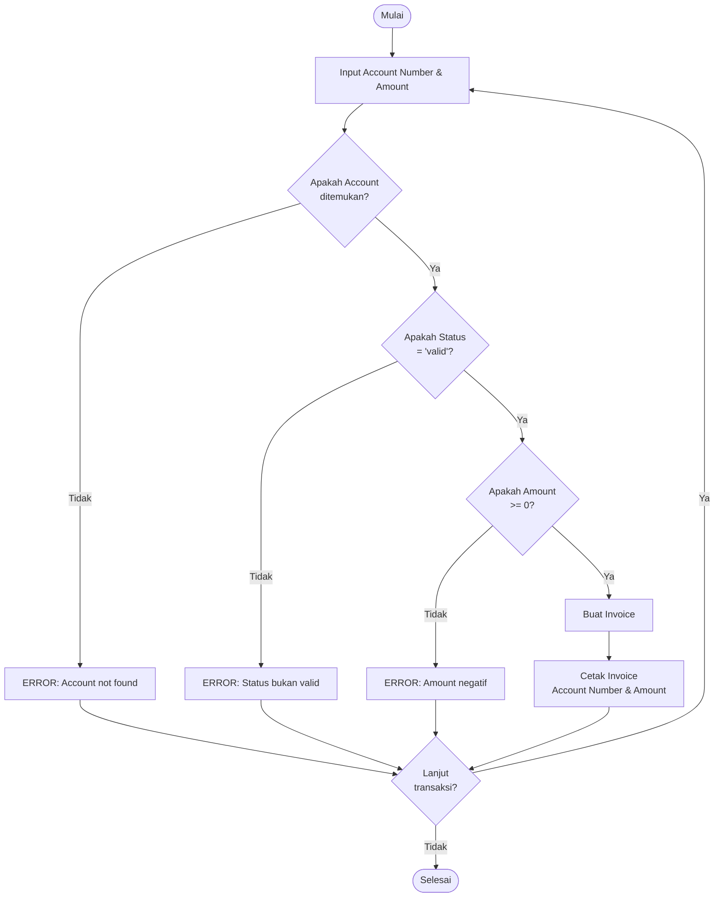

# SOAL 3 – Implementasi Pre/Post Conditions (Java)

## 📌 Deskripsi Soal

Buat program untuk menghitung biaya servis komputer dengan **precondition** dan **postcondition** berikut:

- **Precondition 1**: Customer datang dengan `account-number` yang ada di daftar **ACCOUNTS** dan memiliki `status-code = "valid"`.
- **Postcondition 1**: Jika precondition 1 terpenuhi → **Invoice diproduksi** yang berisi `account-number` dan `amount-of-sale`.
- **Precondition 2**: Precondition 1 gagal (akun tidak ditemukan **atau** `status-code ≠ "valid"`).
- **Postcondition 2**: Jika precondition 2 → **tampilkan error message**.

---

## 📊 Flowchart



---

## ⚙️ Cara Compile & Run

1. Simpan file dengan nama `Main.java`.

2. **Compile:**
   ```bash
   javac Main.java
   ```

3. **Jalankan:**
   ```bash
   java Main
   ```

---

## 📖 Struktur Program

| Class | Deskripsi |
|-------|-----------|
| `Account` | Menyimpan data akun (`accountNumber`, `statusCode`) |
| `Invoice` | Menyimpan & mencetak invoice (`accountNumber`, `amountOfSale`) |
| `Main` | Antarmuka program (input/output dari user) |

### Method Utama

- `initializeAccounts()` → Inisialisasi data akun default
- `findAccount(String accountNumber)` → Mencari akun berdasarkan account number
- `processTransaction(String accountNumber, double amountOfSale)` → Memproses transaksi sesuai pre/post conditions

---

## 🖥️ Contoh Output

### 1. ✅ Precondition 1 terpenuhi

**Input:**
```
Masukkan Account Number: ACC001
Masukkan Amount of Sale: 150.50
```

**Output:**
```
Processing transaction for account: ACC001

=== INVOICE ===
Account Number: ACC001
Amount of Sale: $150.50
===============
```

### 2. ❌ Account tidak ditemukan

**Input:**
```
Masukkan Account Number: ACC999
Masukkan Amount of Sale: 100
```

**Output:**
```
ERROR: Account number 'ACC999' not found in system.
```

### 3. ❌ Status account bukan valid

**Input:**
```
Masukkan Account Number: ACC003
Masukkan Amount of Sale: 50
```

**Output:**
```
ERROR: Account 'ACC003' status is 'invalid'. Only 'valid' accounts can proceed.
```

### 4. ❌ Amount negatif

**Input:**
```
Masukkan Account Number: ACC004
Masukkan Amount of Sale: -10
```

**Output:**
```
ERROR: Amount of sale tidak boleh negatif.
```

---

## 📊 Daftar Akun Default

Program sudah mengisi akun otomatis saat inisialisasi:

| Account Number | Status |
|---------------|--------|
| ACC001 | ✅ valid |
| ACC002 | ✅ valid |
| ACC003 | ❌ invalid |
| ACC004 | ✅ valid |
| ACC005 | ⚠️ suspended |

---

## ✅ Kesesuaian dengan Soal

### Precondition 1 & Postcondition 1
- ✅ Akun ditemukan di sistem
- ✅ Status akun = "valid"
- ✅ **Hasil:** Invoice dicetak dengan account number dan amount of sale

### Precondition 2 & Postcondition 2
- ❌ Akun tidak ditemukan **ATAU** status ≠ "valid"
- ✅ **Hasil:** Error message ditampilkan

---

## 🎯 Fitur Tambahan

- Input validation untuk amount (tidak boleh negatif)
- Loop interaktif untuk multiple transactions
- Format currency dengan 2 desimal
- Daftar akun ditampilkan di awal program

---

## 📝 Catatan

Program ini dibuat menggunakan **Java 7** sesuai requirement tugas. Implementasi menggunakan:
- `ArrayList` untuk menyimpan daftar akun
- `Scanner` untuk input user
- Exception handling untuk validasi input

---

## 👨‍💻 Cara Penggunaan

1. Jalankan program
2. Lihat daftar akun yang tersedia
3. Masukkan account number
4. Masukkan amount of sale
5. Program akan memproses sesuai pre/post conditions
6. Ketik `exit` untuk keluar dari program

---

**Dibuat untuk memenuhi TUGAS MINGGU INI - Implementasi PSPEC dari DPPL**