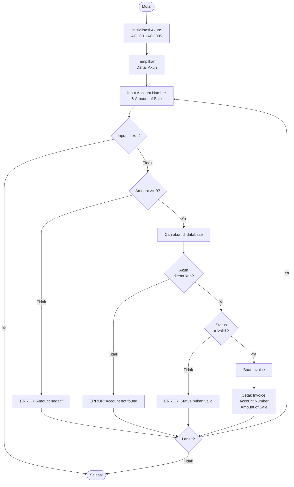

# SOAL 3 – Implementasi Pre/Post Conditions (C)

## 📌 Deskripsi Soal

Buat program untuk sistem transaksi pelanggan dengan **precondition** dan **postcondition** berikut:

- **Precondition 1**: Customer datang dengan `account-number` yang ada di daftar **ACCOUNTS** dan memiliki `status-code = "valid"`.
- **Postcondition 1**: Jika precondition 1 terpenuhi → **Invoice diproduksi** yang berisi `account-number` dan `amount-of-sale`.
- **Precondition 2**: Precondition 1 gagal (akun tidak ditemukan **atau** `status-code ≠ "valid"`).
- **Postcondition 2**: Jika precondition 2 → **tampilkan error message**.

---

## 📊 Flowchart



---

## ⚙️ Cara Compile & Run

**Compile:**
```bash
gcc soal3.c -o soal3
```

**Run:**
```bash
./soal3
```

---

## 📖 Struktur Program

### Struct yang Digunakan

```c
typedef struct {
    char accountNumber[20];
    char statusCode[20];
} Account;

typedef struct {
    char accountNumber[20];
    double amountOfSale;
} Invoice;
```

### Fungsi Utama

| Fungsi | Deskripsi |
|--------|-----------|
| `initializeAccounts()` | Inisialisasi 5 akun default |
| `findAccount()` | Mencari akun berdasarkan account number |
| `processTransaction()` | Memproses transaksi sesuai pre/post conditions |
| `printInvoice()` | Mencetak invoice |

---

## 🖥️ Contoh Output

### 1. ✅ Precondition 1 terpenuhi

**Input:**
```
Masukkan Account Number: ACC001
Masukkan Amount of Sale: $150.50
```

**Output:**
```
Processing transaction for account: ACC001

=== INVOICE ===
Account Number: ACC001
Amount of Sale: $150.50
===============
```

### 2. ❌ Account tidak ditemukan

**Input:**
```
Masukkan Account Number: ACC999
Masukkan Amount of Sale: $100
```

**Output:**
```
Processing transaction for account: ACC999
ERROR: Account number 'ACC999' not found in system.
```

### 3. ❌ Status account bukan valid

**Input:**
```
Masukkan Account Number: ACC003
Masukkan Amount of Sale: $50
```

**Output:**
```
Processing transaction for account: ACC003
ERROR: Account 'ACC003' status is 'invalid'. Only 'valid' accounts can proceed.
```

### 4. ❌ Amount negatif

**Input:**
```
Masukkan Account Number: ACC004
Masukkan Amount of Sale: $-10
```

**Output:**
```
ERROR: Amount of sale tidak boleh negatif.
```

### 5. 🔄 Menu Interaktif

**Tampilan Awal:**
```
=== SISTEM TRANSAKSI PELANGGAN ===

Daftar Akun yang Tersedia:
- ACC001 (Status: valid)
- ACC002 (Status: valid)
- ACC003 (Status: invalid)
- ACC004 (Status: valid)
- ACC005 (Status: suspended)

--- Menu Transaksi ---
Masukkan Account Number (atau 'exit' untuk keluar): 
```

---

## 📊 Daftar Akun Default

Program otomatis menginisialisasi 5 akun:

| Account Number | Status | Hasil Transaksi |
|---------------|--------|-----------------|
| ACC001 | ✅ valid | Invoice berhasil |
| ACC002 | ✅ valid | Invoice berhasil |
| ACC003 | ❌ invalid | Error message |
| ACC004 | ✅ valid | Invoice berhasil |
| ACC005 | ⚠️ suspended | Error message |

---

## ✅ Kesesuaian dengan Soal

### Precondition 1 & Postcondition 1
1. ✅ Akun ditemukan di sistem (`findAccount()` return != NULL)
2. ✅ Status akun = "valid" (`strcmp(statusCode, "valid") == 0`)
3. ✅ **Hasil:** Invoice dicetak dengan account number dan amount of sale

### Precondition 2 & Postcondition 2
1. ❌ Akun tidak ditemukan **ATAU**
2. ❌ Status ≠ "valid" (invalid, suspended, dll)
3. ✅ **Hasil:** Error message ditampilkan

---

## 🎯 Fitur Program

- ✅ Validasi account number (cek keberadaan)
- ✅ Validasi status code (harus "valid")
- ✅